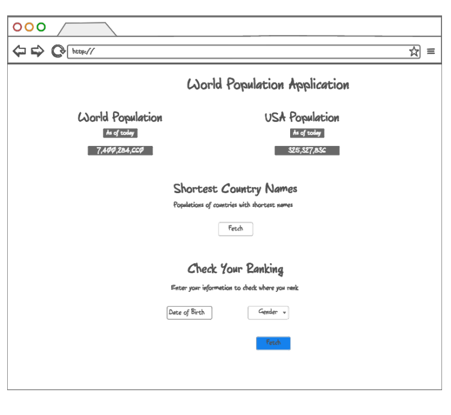
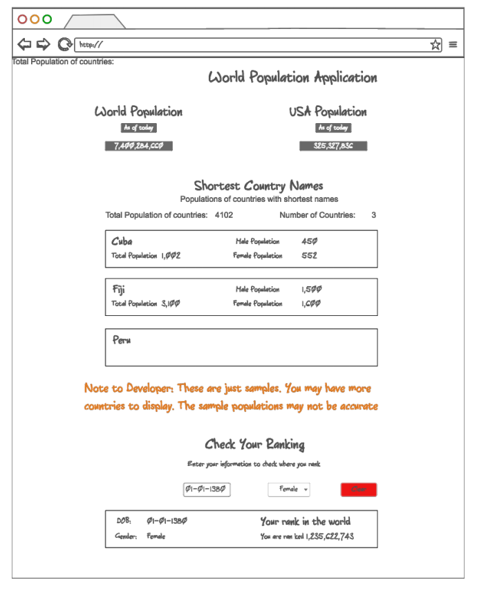

# World Population

Use http://api.population.io/to to build a World Population application.

The application will be broken down into three parts:
1) World and USA Population
                    When the page first loads, hit the API, and show the World population and USA population as of the current date.

2) Countries with the short names and their populations
                    When the user clicks the 'Fetch' button in this section, the application will hit the API, get all the country names, choose the countries tied for the shortest name (ie Cuba) and display them as React components. When the user clicks on any of these country widgets, use the API to find the overall, male, and female population of current (ie as of 2017) 18 year olds and display within the country component.
You should also keep track of and display on the page:
                    a)The number of countries being displayed
                    b)The total population of those countries which the user has clicked on to obtain their individual populations

3) Let a user check their ranking
                    Provide a place for users to enter their date of birth, country and gender. When they submit this information, please render a React component showing their rank within the world.

#Mockups

